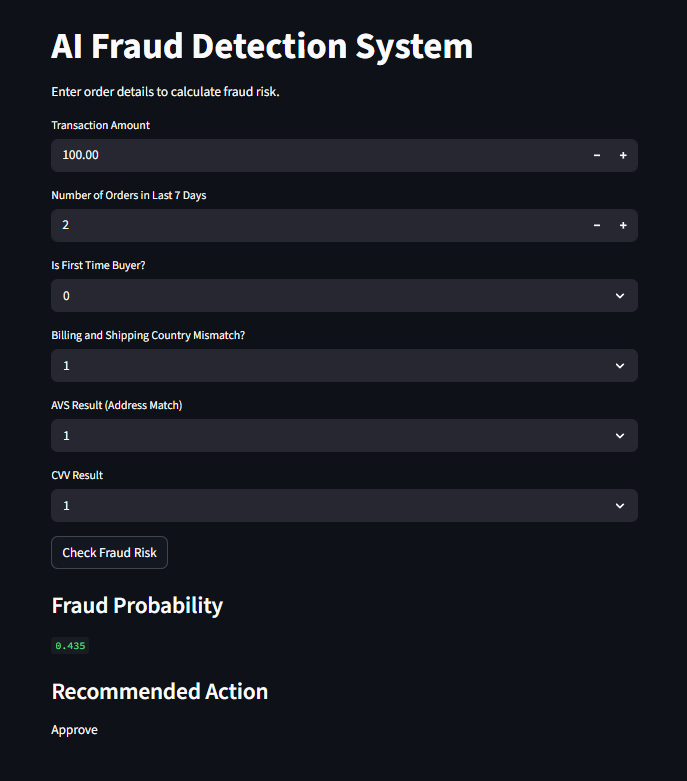

# AI-Based Fraud Detection System

## Overview

This project implements a machine learning–based fraud detection system for online transactions.
The system assigns a **fraud risk score** to each order and recommends an action such as approving the transaction, sending it for manual review, or cancelling the order.

The goal is to simulate a simplified version of a real-world **e-commerce fraud detection pipeline** using a synthetic dataset and a supervised learning model.

---

## Problem Statement

Online platforms frequently face fraudulent transactions that lead to financial loss and chargebacks.
The objective of this project is to build a model that can:

* Predict whether an order is fraudulent
* Assign a fraud probability score
* Recommend an operational action based on risk level

---

## Dataset

A synthetic dataset of **400 transactions** was generated to simulate common fraud signals.

### Features

* **amount** – transaction amount
* **is_first_time_buyer** – whether the customer is new
* **payment_avs_result** – address verification result
* **payment_cvv_result** – CVV verification result
* **num_orders_last_7_days** – order velocity indicator
* **country_mismatch** – billing vs shipping country mismatch
* **chargeback_flag** – target variable indicating fraud

Fraud labels were generated using a **risk scoring mechanism** that incorporates realistic fraud indicators such as high transaction value, verification failures, and unusual purchase behavior.

---

## Methodology

### 1. Data Generation

Synthetic data was generated using probabilistic rules to simulate realistic fraud patterns.

### 2. Exploratory Data Analysis

Key visualizations were used to analyze:

* Fraud vs non-fraud distribution
* Transaction amount patterns
* Order velocity behavior
* Fraud rate across different customer types

### 3. Feature Engineering

* Created **country mismatch** indicator
* Converted categorical verification results into numeric values
* Removed non-predictive identifiers such as email and order ID

### 4. Model Training

A **Random Forest Classifier** was trained to detect fraud patterns.

Reasons for choosing Random Forest:

* Handles nonlinear relationships well
* Works effectively with tabular data
* Provides feature importance for interpretability

### 5. Model Evaluation

The model was evaluated using metrics appropriate for fraud detection:

* Precision
* Recall
* Confusion Matrix
* ROC-AUC Score

Fraud detection prioritizes **high recall**, since missing fraudulent transactions can result in financial loss.

### 6. Risk Scoring System

The model outputs a **fraud probability**, which is converted into operational actions:

| Fraud Probability | Action              |
| ----------------- | ------------------- |
| > 0.8             | Cancel Order        |
| 0.5 – 0.8         | Manual Verification |
| < 0.5             | Approve Transaction |

---

## Streamlit Demo

A **Streamlit application** was developed to demonstrate the fraud detection system interactively.

Users can input transaction details such as:

* transaction amount
* order velocity
* first-time buyer indicator
* verification results

The application outputs:

* Fraud probability score
* Recommended action
* Risk visualization
## Demo



---

## Technologies Used

* Python
* Pandas
* NumPy
* Scikit-learn
* Matplotlib
* Streamlit

---

## How to Run the Project

### 1. Install dependencies

```
pip install streamlit pandas scikit-learn matplotlib joblib
```

### 2. Run the Streamlit application

```
streamlit run streamlit_app.py
```

### 3. Open in browser

```
http://localhost:8501
```

---

## Key Insights

* Transaction amount emerged as the most influential feature in fraud prediction.
* Address verification failure and CVV mismatch significantly increase fraud risk.
* High order velocity is another strong behavioral signal.
* Combining multiple behavioral indicators improves detection performance.

---

## Future Improvements

* Incorporate device and IP-based behavioral features
* Use larger and more realistic datasets
* Deploy the system as a real-time API
* Implement advanced explainability techniques such as SHAP
